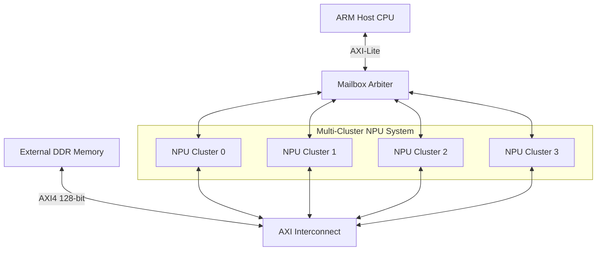
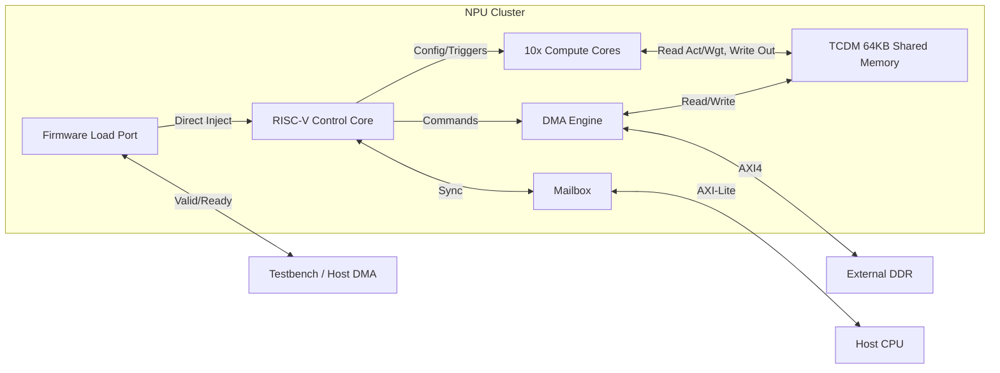
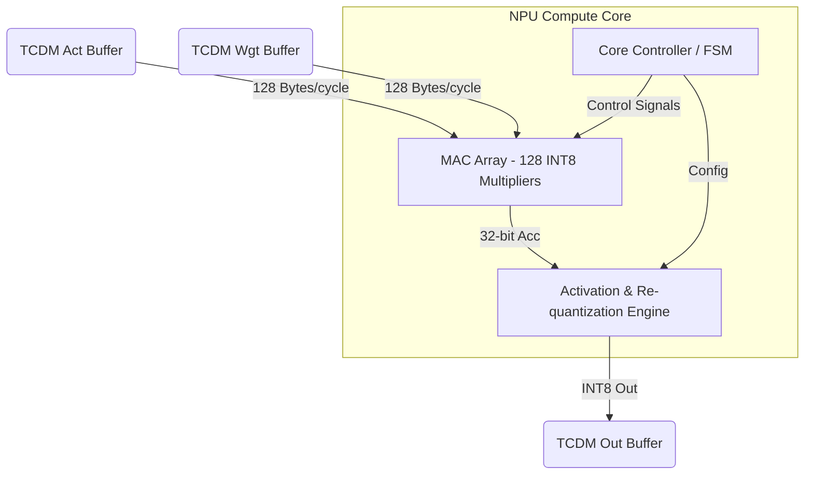

# NPU Accelerator System Architecture

This document describes the overall and detailed hardware architecture of the Neural Processing Unit (NPU) accelerator designed for high-performance edge AI inference (e.g., MobileNetV2, YOLOv8).

## 1. Overall System Architecture

The accelerator is built on a **Multi-Cluster** architecture, balancing massive parallel computing power with localized memory subsystems to achieve high TOPS (Tera Operations Per Second) while keeping data movement energy low.

The highest level (`npu_multi_cluster_top`) instantiates **4 NPU Clusters**, multiplexing their AXI master interfaces and Host Mailbox interfaces to connect to the external ARM Host CPU and DDR Memory.

## 2. Cluster Level Architecture

Each **NPU Cluster** is an independent, self-contained AI computing node. It features its own RISC-V controller, memory space, and compute array.

### Cluster Components:
- **Control Core**: A 32-bit RISC-V integer core (RV32I) responsible for parsing the neural network graph, orchestrating data movement, and triggering computations.
- **ISPM (Instruction Scratchpad Memory)**: 32KB memory storing the RISC-V firmware (`tensorlite_ops.bin`).
- **Mailbox**: A synchronization primitive between the Host CPU and the RISC-V core.
- **Firmware Load Port**: A direct memory injection interface (custom valid/ready) allowing the Testbench or Host DMA to preload firmware directly into I-SPM without AXI overhead.
- **Memory Subsystem**: Features a Tightly Coupled Data Memory (TCDM) and a DMA Engine.
- **10 Compute Cores**: Dedicated hardware blocks for matrix-multiplication and non-linear activations.

## 3. Memory Subsystem Architecture

The **TCDM (Tightly Coupled Data Memory)** is a 64KB SRAM block that acts as the L1 scratchpad for the NPU. To provide enough bandwidth for 10 Compute Cores and the DMA engine to access memory simultaneously without bottlenecks, the TCDM is heavily banked and interconnected.

- **32 Memory Banks**: The 64KB memory is interleaved across 32 physical SRAM banks (word-interleaved).
- **Logarithmic Interconnect**: A full crossbar / logarithmic network routes requests from 10 Cores + 1 DMA + 1 RISC-V to the 32 banks.
- **Arbiter**: Uses Round-Robin arbitration to resolve bank conflicts.

## 4. Compute Core Architecture

The **Compute Core** is the heart of the NPU, highly optimized for INT8 neural network operations. Each of the 10 cores per cluster operates independently, working on different tiles of the output tensor.

### 4.1 MAC Array
- Performs 128 INT8 Multiply-Accumulate (MAC) operations per cycle.
- Calculates `Accumulator += Activation * Weight`.
- Provides maximum theoretical throughput: `10 Cores * 128 MACs * 1 GHz = 1.28 Tera-MACs/sec per Cluster` (5.12 TMACs/s for Multi-Cluster).

### 4.2 Activation Engine
- Processes the 32-bit accumulator back into an INT8 value to write to memory.
- Contains scaling factors (Multiplier and Bit-shift) for quantization recovery.
- Hardware Lookup Tables (LUTs) for complex activations:
  - **Standard**: ReLU, Leaky ReLU (via bit-shift), ReLU6 (via clamping).
  - **YOLO specific (256-entry LUTs)**: SiLU (Swish), Mish, Sigmoid.
